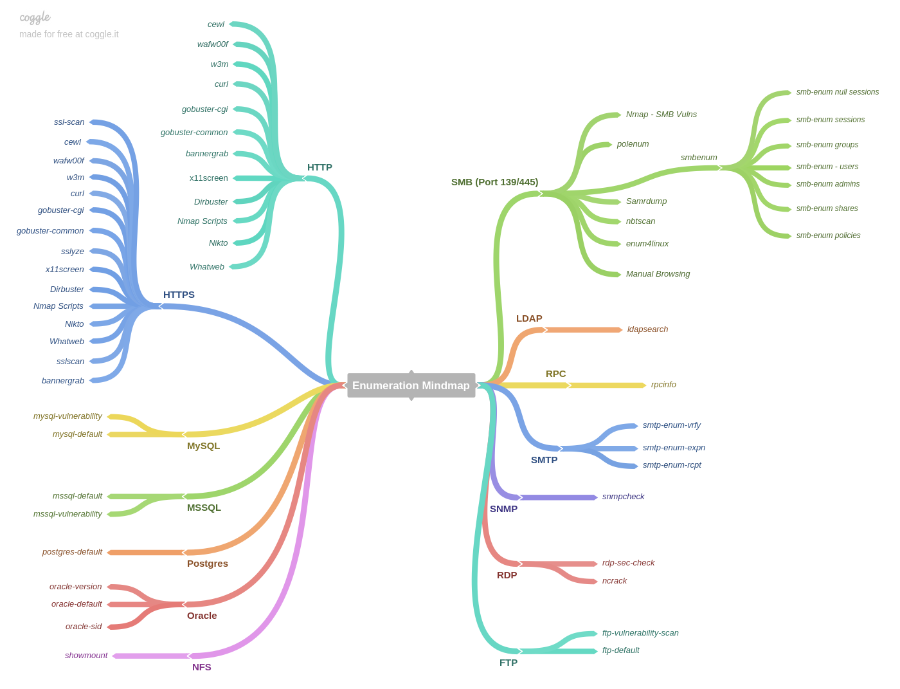

# General methodology

## General OSCP/CTF Tips


Restart the box - wait 2+ minutes until it comes back and all services have started




### For every open port TCP/UDP

```text
http://packetlife.net/media/library/23/common_ports.pdf
```

* Find service and version
* Find known service bugs
* Find configuration issues
* Run nmap port scan / banner grabbing

### GoogleFoo

* Every error message
* Every URL path
* Every parameter to find versions/apps/bugs
* Every version exploit db
* Every version vulnerability

### If app has auth

* User enumeration
* Password bruteforce
* Default credentials google search

#### If everything fails try:

```text
nmap --script exploit -Pn $ip
```

## Individual Host Scanning

### Service Scanning

### WebApp

* Nikto
* dirb
* dirbuster
* wpscan
* dotdotpwn/LFI suite
* view source
* davtest/cadeavar
* droopscan
* joomscan
* LFI\RFI test

### Linux\Windows

* snmpwalk -c public -v1 $ip 1
* smbclient -L //$ip
* smbmap -H $ip
* rpcinfo
* Enum4linux

#### Anything Else

* nmap scripts
* hydra
* MSF Aux Modules
* Download software....uh'oh you're at this stage

## Exploitation

* Gather version numbers
* Searchsploit
* Default Creds
* Creds previously gathered
* Download the software

## Post Exploitation

### Linux

* linux-local-enum.sh
* linuxprivchecker.py
* linux-exploit-suggestor.sh
* unix-privesc-check.py

### Windows

* wpc.exe
* windows-exploit-suggestor.py
* windows\_privesc\_check.py
* windows-privesc-check2.exe

## Priv Escalation

* access internal services \(portfwd\)
* add account

### Windows

* List of exploits

### Linux

* sudo su
* KernelDB
* Searchsploit

## Final

* Screenshot of IPConfig/WhoamI
* Copy proof.txt
* Dump hashes
* Dump SSH Keys
* Delete files
* Reset Machine


