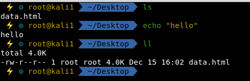

# Terminator Configuration

## Setup

### In Preferences:

```text
Infinite scrollback is selected
Profiles>colors>Change palette to "White on Black"
Profiles>Background>Solid Color
```

### Google Search Plugin

```text
https://github.com/msudgh/terminator-search
```

## Shortcuts

```text
Ctrl + Shift + O = Virtual Split
Ctrl + Shift + E = Horizontal Split

Ctrl + Shift + Z = Maximizes a current tabbed window to full screen and then restores to tabbed by pressing again
Ctrl + Shift + T = Opens a new tab

Ctrl + Shift + C = Copy to clipboard
Ctrl + Shift + V = Paste
```

double click on tab name to rename

## zsh configuration



```text
nano ~/.zshrc
```

```text
# If you come from bash you might have to change your $PATH.
# export PATH=$HOME/bin:/usr/local/bin:$PATH

# Path to your oh-my-zsh installation.
  export ZSH="/root/.oh-my-zsh"

# Set name of the theme to load --- if set to "random", it will
# load a random theme each time oh-my-zsh is loaded, in which case,
# to know which specific one was loaded, run: echo $RANDOM_THEME
# See https://github.com/robbyrussell/oh-my-zsh/wiki/Themes
ZSH_THEME="agnoster"

# Set list of themes to pick from when loading at random
# Setting this variable when ZSH_THEME=random will cause zsh to load
# a theme from this variable instead of looking in ~/.oh-my-zsh/themes/
# If set to an empty array, this variable will have no effect.
# ZSH_THEME_RANDOM_CANDIDATES=( "robbyrussell" "agnoster" )

# Uncomment the following line to use case-sensitive completion.
# CASE_SENSITIVE="true"

# Uncomment the following line to use hyphen-insensitive completion.
# Case-sensitive completion must be off. _ and - will be interchangeable.
# HYPHEN_INSENSITIVE="true"

# Uncomment the following line to disable bi-weekly auto-update checks.
# DISABLE_AUTO_UPDATE="true"

# Uncomment the following line to change how often to auto-update (in days).
# export UPDATE_ZSH_DAYS=13

# Uncomment the following line to disable colors in ls.
# DISABLE_LS_COLORS="true"

# Uncomment the following line to disable auto-setting terminal title.
# DISABLE_AUTO_TITLE="true"

# Uncomment the following line to enable command auto-correction.
ENABLE_CORRECTION="true"

# Uncomment the following line to display red dots whilst waiting for completion.
COMPLETION_WAITING_DOTS="true"

# Uncomment the following line if you want to disable marking untracked files
# under VCS as dirty. This makes repository status check for large repositories
# much, much faster.
# DISABLE_UNTRACKED_FILES_DIRTY="true"

# Uncomment the following line if you want to change the command execution time
# stamp shown in the history command output.
# You can set one of the optional three formats:
# "mm/dd/yyyy"|"dd.mm.yyyy"|"yyyy-mm-dd"
# or set a custom format using the strftime function format specifications,
# see 'man strftime' for details.
# HIST_STAMPS="mm/dd/yyyy"

# Would you like to use another custom folder than $ZSH/custom?
#ZSH_CUSTOM=~/.oh-my-zsh/custom/plugins 

# Which plugins would you like to load?
# Standard plugins can be found in ~/.oh-my-zsh/plugins/*
# Custom plugins may be added to ~/.oh-my-zsh/custom/plugins/
# Example format: plugins=(rails git textmate ruby lighthouse)
# Add wisely, as too many plugins slow down shell startup.
plugins=(
	 git
	 colored-man-pages
	 zsh-syntax-highlighting
 	 zsh-autosuggestions
)
source $ZSH/oh-my-zsh.sh

# User configuration

# export MANPATH="/usr/local/man:$MANPATH"

# You may need to manually set your language environment
# export LANG=en_US.UTF-8

# Preferred editor for local and remote sessions
# if [[ -n $SSH_CONNECTION ]]; then
#   export EDITOR='nano'
# else
#   export EDITOR='nano'
# fi

# Compilation flags
# export ARCHFLAGS="-arch x86_64"

# ssh
# export SSH_KEY_PATH="~/.ssh/rsa_id"

# Set personal aliases, overriding those provided by oh-my-zsh libs,
# plugins, and themes. Aliases can be placed here, though oh-my-zsh
# users are encouraged to define aliases within the ZSH_CUSTOM folder.
# For a full list of active aliases, run `alias`.
#
# Example aliases
 alias zshconfig="mate ~/.zshrc"
# alias ohmyzsh="mate ~/.oh-my-zsh"
alias ss="searchsploit"
alias l='ls -la'
alias webup='python -m SimpleHTTPServer 80'
alias rtfm="/opt/rtfm/rtfm.py"
alias xclip="xclip -sel c" # copy output of previous command
alias ltr="ls -ltr" # list directory newest at bottom 
```

follow guide:

```text
https://hackernoon.com/oh-my-zsh-made-for-cli-lovers-bea538d42ec1
```

syntax highlighting

```text
https://github.com/zsh-users/zsh-syntax-highlighting
```

